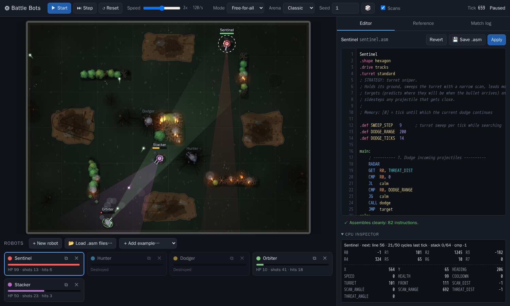

# Battle Bots

Program robots in a small assembly language and watch them fight in a 2D arena.



## Quick start

There is nothing to install and no build step.

1. Open `index.html` in a modern browser (Chrome, Edge or Firefox). Double-clicking the file works.
2. Five example robots are preloaded. Press **▶ Start**.

If you prefer to serve it, any static server works, for example `python -m http.server` and then http://localhost:8000.

**Hosting:** the repository root is a complete static site, so it can be served as-is from GitHub Pages or any other static host.

Node.js (v16+) is only needed for the optional command-line tools:

```sh
npm test              # assembler, VM and simulation tests
npm run match         # one headless match between the examples, printed to the terminal
npm run tournament    # 50 seeds, win counts per robot
node tools/headless.js --seed 7 my_bot.asm examples/hunter.asm
node tools/headless.js --rounds 50 --arena random my_bot.asm examples/*.asm   # test across 50 random maps
node tools/headless.js --teams 2 a.asm b.asm c.asm d.asm   # 2v2: first two files are team A, the rest team B
npm run build         # regenerate examples/*.asm and docs/LANGUAGE.md from the JS sources
node tools/balance.js 20 > docs/balance-results.json  # compare arenas, bot constants and rules
```

## Using the sandbox

| Control | What it does |
|---|---|
| **▶ Start / ❚❚ Pause** (Space) | Run or pause the match. |
| **⏭ Step** (`.`) | Advance exactly one tick. The CPU inspector and the yellow gutter marker show the next line each robot will execute. |
| **↺ Reset** (`R`) | Respawn every robot with its *applied* code. The seed decides spawn points and `RAND`, so a seed always replays the same match. |
| **Mode** | **Free-for-all**, **Teams 2v2** or **Teams 3v3**. In a team mode each robot card gets **A / B / Bench** buttons, and **⧉** duplicates a robot so you can field several copies. A team match only starts when both teams have exactly the right number of working robots. |
| **Arena** | **Classic** is the fixed default layout, with four mud patches. **Random** generates a mirrored layout of obstacles and mud from the seed, so 🎲 gives a new map and the same seed always gives the same map. **Open** has no obstacles or mud, which is useful for testing aim and dodging. |
| **Speed** | 0.1× to 60× (6 to 3600 ticks per second). |
| **Scans** | Show or hide each robot's scan cone. |
| **+ New robot / 📂 Load .asm files… / + Add example** | Add robots. Loading accepts several files at once, and you can also drag and drop `.asm` files onto the page. **Each file becomes one robot.** |
| **Editor → Apply** (Ctrl+Enter) | Assemble the code and use it. Before the match starts, the arena resets. During a match, the robot hot-swaps to the new program without losing its position or health. |
| **💾 Save .asm** (Ctrl+S) | Download the editor contents as a `.asm` file. |
| **Revert** | Discard edits you have not applied. |

The editor checks your code as you type. Errors appear under the editor and in the line gutter, and clicking an error jumps to that line. Robots with syntax errors stay in the roster but are left out of the arena until fixed. The **CPU inspector** under the editor shows the selected robot's registers and sensors live. Click its heading to collapse it and give the editor more room.

Apply rejects drafts with syntax errors and keeps the robot's previously applied program. The draft remains in the editor so you can fix it. Single-robot command-line practice runs stop after 6000 ticks and report a practice result; browser practice mode continues until paused.

The roster, seed and arena choice are saved in your browser's `localStorage`. Keyboard shortcuts (Space, `.`, `R`) are ignored while you're typing in the editor or a form field.

The arena shows each robot as a tank. The hull points where it's driving, and the turret turns separately. Damaged robots show scorch marks, and below 25% health they trail smoke. A blinking ⚠ marks a robot whose CPU crashed, and a dimmed robot has halted its program.

## Robot files

Customize your bot with up to three optional lines below its name, before any labels, constants or instructions:

```asm
Iron Beetle
.shape hexagon
.drive wheels
.turret twin

main:
    WAIT
    JMP main
```

| Setting | Presets | Default |
|---|---|---|
| `.shape` | `tank`, `circle`, `hexagon`, `wedge` | `tank` |
| `.drive` | `tracks`, `wheels`, `hover` | `tracks` |
| `.turret` | `standard`, `short`, `twin` | `standard` |

These are cosmetic: every bot keeps the same collision radius, movement, bullet origin and weapon stats. Twin turrets still fire one shot. Each setting may appear once; comments and blank lines are allowed between them. Omitted settings retain the default tank appearance. Appearance is saved in the robot source and updates when you press **Apply**.

```asm
Sniper Sam                ; line 1 = robot name
.def RANGE 300            ; optional constants
main:
    SCAN 20               ; look for an enemy in a 20° cone around the turret
    GET  R0, SCAN_DIST
    CMP  R0, 0
    JL   sweep            ; -1 = nothing found
    GET  R1, SCAN_ANGLE
    AIM  R1
    FIRE
    WAIT                  ; end this tick
    JMP  main
sweep:
    GET  R1, TURRET
    ADD  R1, 15
    AIM  R1
    WAIT
```

The full instruction and sensor reference is on the in-app **Reference** tab and in [docs/LANGUAGE.md](docs/LANGUAGE.md). Both are generated from the same table the assembler uses. In summary:

- **Registers:** R0 to R7. **Memory:** 256 words (`[12]`, `[R1]`, `[R1+4]`). **Stack:** 64 entries, shared by PUSH/POP and CALL/RET.
- **Data and arithmetic:** MOV PUSH POP ADD SUB MUL DIV MOD INC DEC NEG ABS MIN MAX AND OR XOR RAND
- **Math:** ATAN2 SIN COS SQRT NORM
- **Flow:** CMP JMP JE JNE JL JLE JG JGE CALL RET NOP WAIT HALT
- **Robot:** GET (read a sensor), SPEED, TURN, HEAD, AIM, FIRE, SCAN (enemies), RADAR (incoming projectiles)
- **Sensors:** X Y HEADING SPEED HEALTH COOLDOWN TURRET SCAN_* THREAT_* FRONT LAST_HIT TICK ENEMIES ALLIES ARENA_W ARENA_H

There is no "dodge" instruction. Robots dodge by calling `RADAR` to find an incoming projectile and its direction, then moving out of its path with `HEAD` and `SPEED`. See `dodge:` in the Sentinel and Dodger examples.

### Example robots (`examples/`)

| Robot | Appearance | Strategy |
|---|---|---|
| **Sentinel** | Hexagon, tracks, standard turret | Stationary sniper. Narrow sweeping scan, leads moving targets, sidesteps bullets (and reverses when that needs less turning). |
| **Hunter** | Wedge, wheels, twin turret | Aggressive chaser. Wide scan, charges straight at the enemy, fires when lined up, never dodges. |
| **Dodger** | Circle, wheels, short turret | Evasive skirmisher. Always moving, bounces off walls, swerves away from every projectile, independent turret. |
| **Orbiter** | Tank, hover, standard turret | Circle-strafer. Locks on, orbits at about 200 units while firing, flips direction near walls. |
| **Stacker** | Hexagon, wheels, twin turret | Cautious patrol with a sweeping gun. Demonstrates nested calls, explicit register saves and reverse-order restoration. |

**Learning the stack:** load [examples/stacker.asm](examples/stacker.asm) and Step through its routines with the CPU inspector open. `main → combat → shoot_if_aligned → angle_error` nests three calls while saving registers with `PUSH`; each routine restores them with `POP` before `RET`. The deepest path uses 11 of the 64 stack entries. The stack is empty at the main loop's `WAIT`, and register `R6` counts completed patrol/gun passes. Helpers can span several CPU ticks without losing their saved values. `CMP` state is not saved by `PUSH`, so each branch checks a fresh comparison after a helper returns.

## Rules of the arena

- 800×600 arena. Rectangular obstacles block movement, bullets and scans.
- Arena layouts:
  - **Classic:** five fixed obstacles.
  - **Open:** none.
  - **Random:** 4 to 9 obstacles generated from the seed, with these guarantees:
    - **Fair:** every obstacle has a twin mirrored through the arena centre.
    - **Passable:** obstacles keep a 44-unit gap from each other and the walls, wider than a robot, so every open area can be reached.
    - **Solid:** obstacles are at least 20 units thick, so bullets can't pass through.
    - **Open enough:** obstacles cover at most 11% of the arena.
- Each tick, every living robot gets **the same 50-cycle budget** (SCAN and RADAR cost 3, everything else costs 1). The order robots run in rotates every tick, and the world is frozen while programs run, so order gives no advantage.
- Movement is physical. Speed is −3 to 5, acceleration 0.5 per tick, the body turns up to 8° per tick and the turret up to 20° per tick.
- Bullets travel 10 units per tick and deal 10 damage, with a 15-tick cooldown between shots.
- **Collisions:** touching a wall or obstacle *at any angle* stops the robot (its speed drops to 0) and deals speed ÷ 2 damage, rounded down. So a contact at speed 1 is free, and at full speed it costs 2. Sliding along a wall at a slight angle counts as a contact every tick. Ramming another robot deals 1 damage to both when they close in at more than 1 unit per tick.
- A robot at 0 HP is destroyed. **The last robot standing wins.** After 6000 ticks, the highest health wins, and a tie is a draw. A single robot runs in practice mode with no victory check.

### Team matches (2v2 and 3v3)

- **No friendly fire:** bullets pass through teammates, and teammates can't damage each other by ramming (they still bump).
- **Teammates are invisible to sensors:** `SCAN` skips them, `RADAR` ignores their bullets, and `ENEMIES` counts opponents only. The `ALLIES` sensor gives the number of living teammates. Any free-for-all robot works in a team unchanged.
- **Fair spawns:** team A starts in the left half. Each team B robot starts at the mirror image of its team A counterpart, through the arena centre, facing the mirrored direction. All three arena layouts are point-symmetric, so both teams get identical terrain.
- **Victory:** the last team with a robot alive wins. At the time limit, the team with the most total health wins.
- Team A is drawn in warm colours and team B in cool colours, with an "A ·" or "B ·" before each robot's name.

## Limits

Out-of-range values are clamped without an error, so `SPEED 100` gives 5 and `SCAN 500` gives 90.

| Thing | Limit |
|---|---|
| Speed | −3 to 5 units/tick, acceleration 0.5/tick; capped at 2 either way while your center is in mud |
| Turning | body 8°/tick, turret 20°/tick |
| Firing | 1 shot per 15 ticks; bullets: speed 10, damage 10 |
| Health | 100, no healing |
| Scan / radar | scan cone 1° to 90°, reach 2400 / √width (90° reaches 252 units, 16° reaches 600), blocked by obstacles; radar 250 units, nearest bullet only |
| CPU | 50 cycles per tick, 8 registers, 256 memory words, 64 stack entries, 32-bit integers that wrap around |
| Robot name | 24 characters |
| Match length | 6000 ticks |

There's no limit on the number of robots in a match or on program length. Colours repeat after 8 robots, and a very crowded arena spawns extra robots at a fallback point. All values live in `CONFIG` in `js/core/isa.js`.

## How the virtual CPU works

Each robot runs its assembly program on a small virtual CPU implemented in JavaScript. Pressing **Apply** assembles the source into instructions: labels become instruction positions, constants become numbers, and operands are checked against the language rules. Each instruction keeps its source line so errors and the CPU inspector can point back to your code.

Each CPU owns 8 registers (`R0`–`R7`), 256 memory words, a 64-entry stack shared by data and subroutine calls, a program counter pointing to the next instruction, and the result of the last `CMP`. Registers and memory start at zero. Values use signed 32-bit integers and wrap on overflow.

Every simulation tick, each living robot gets **up to 50 CPU cycles**. Most instructions cost 1 cycle; `SCAN` and `RADAR` cost 3. `WAIT` ends the CPU's turn and discards unused cycles. When the budget runs out, execution resumes at the next pending instruction on the following tick. Running past the end of the program wraps to its first instruction; `HALT` stops the CPU until reset or program reload.

For example, this robot scans for an enemy and requests movement toward it:

```asm
Chaser
main:
    SCAN 60
    GET  R0, SCAN_DIST
    CMP  R0, 0
    JL   idle
    GET  R1, SCAN_ANGLE
    HEAD R1
    SPEED 5
idle:
    WAIT
    JMP  main
```

`SCAN_DIST` is −1 when no enemy is found, so `JL idle` skips the movement commands in that case. Otherwise, `HEAD` sets a desired body heading and `SPEED` sets a desired speed. Existing movement commands persist, so losing sight of an enemy does not stop this robot automatically.

Commands request actions rather than instantly changing the body. All CPUs run before physical movement; then the world applies turning, acceleration, movement, collisions, requested shots, and projectile motion. This gives every CPU the same physical state to inspect during a tick. `SCAN` and `RADAR` update their result sensors immediately, while a command such as `AIM` takes effect during the later physical update. Even a halted or faulted CPU leaves its body following its last movement and aiming commands.

See [docs/LANGUAGE.md](docs/LANGUAGE.md) for instruction details, sensor behavior, and execution order.

## Safety: bad code can't break the arena

- **Infinite loops:** the VM stops after the robot's cycle budget each tick and resumes on the next tick, so a `loop: JMP loop` only wastes its own robot's time.
- **Runtime errors** (division by zero, stack overflow, memory out of range, SQRT of a negative number): the robot's CPU *faults* and halts with a message such as `Line 12: division by zero`, shown in the inspector and the match log. Its body stays in the arena. Other robots are unaffected.
- **Isolation:** a VM only has its own registers, memory and stack, plus a narrow I/O interface (`sense`, `speed`, `aim`, …). It never touches world objects directly. JavaScript exceptions are trapped per robot.

## Keeping robots private

Robot files you don't want published, such as competition entries, can stay in the folder: just list them in `.gitignore`. They still load in your local copy through **📂 Load .asm files…**, but they're never committed or served from GitHub Pages.

## Architecture

See [docs/REVIEW_AND_BALANCE.md](docs/REVIEW_AND_BALANCE.md) for the second review, adjustable-parameter interactions, and seeded balance measurements. The reusable `tools/balance.js` experiment changes rules only in its own process.

```
index.html            page layout; loads scripts in order (no bundler, works from file://)
css/style.css
js/core/              pure logic, no DOM: runs in the browser and in Node
  isa.js              instruction set, sensors, constants (single source of truth)
  assembler.js        source -> program, or a list of { line, message } errors
  vm.js               isolated CPU with cycle budget and fault handling
  geometry.js         angles, ray/rect tests, collision push-out, seeded RNG
  world.js            arena simulation: tick loop, physics, sensors, damage, victory
  examples.js         built-in example robots
js/ui/
  renderer.js         canvas drawing and visual effects (read-only view of the world)
  editor.js           textarea editor with highlighting, gutter, error and exec markers
  app.js              roster, controls, editor wiring, inspector, persistence, main loop
tools/                Node CLI: headless matches, doc and example generation
tests/run-tests.js    dependency-free test suite
examples/*.asm        example robots as loadable files
docs/LANGUAGE.md      generated language reference
```

Data flows one way: **source → `assemble()` → program → `VM` (one per robot) → `World.step()` → `Renderer.draw()`**. To add an instruction, add a row to `INSTRUCTIONS` in `isa.js` and a `case` in `VM.exec`. The assembler, the in-app reference and `docs/LANGUAGE.md` (after `npm run build`) pick it up automatically.
